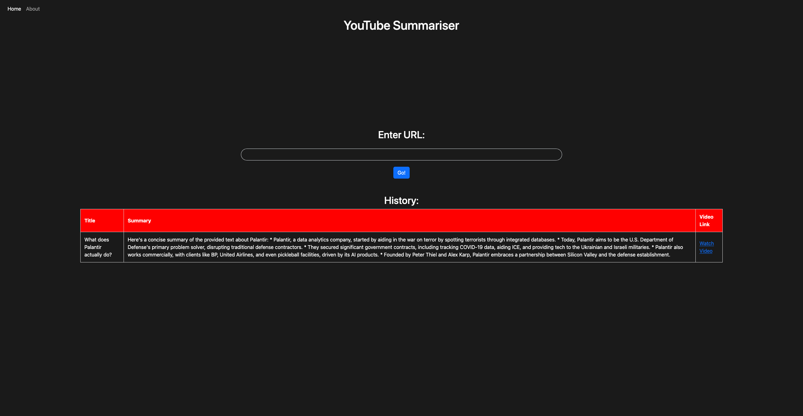

# YouTube Summarizer Backend

Save time with an AI-powered YouTube video summarizer that provides concise summaries and lets you jump directly to relevant sections.

## Features

- **Video Summaries**: Get accurate, concise summaries of any YouTube video
- **Smart Navigation**: Jump directly to specific parts of videos by asking follow-up questions
- **Time-Saving**: Skip through lengthy content while still capturing key information

## Screenshots

### Homepage



### Video Summary


### Follow-up Questions


## Technology Stack

- **YouTubeTranscriptApi**: Extracts transcripts from YouTube videos
- **Google's Gemini AI**: Generates accurate video summaries and processes follow-up questions
- **Flask**: Backend API framework

## Installation

1. Clone the repository:

   ```
   git clone https://github.com/rohansatram/YouTubeSummariserBackend.git
   cd YouTubeSummariserBackend
   ```

2. Install dependencies:

   ```
   pip install -r requirements.txt
   ```

3. Configure environment:

   - Rename `.env_example` to `.env`
   - Add your Google Gemini API key to the `.env` file

4. Run the application:

   ```
   python app.py
   ```

5. For the complete experience, also install the backend:
   [YouTube Summarizer Backend](https://github.com/rohansatram/YouTubeSummariserBackend)

## How It Works

1. Paste any YouTube URL into the search field
2. The system extracts the video transcript
3. Gemini AI processes the transcript to generate a concise summary
4. Ask follow-up questions to jump directly to relevant parts of the video
